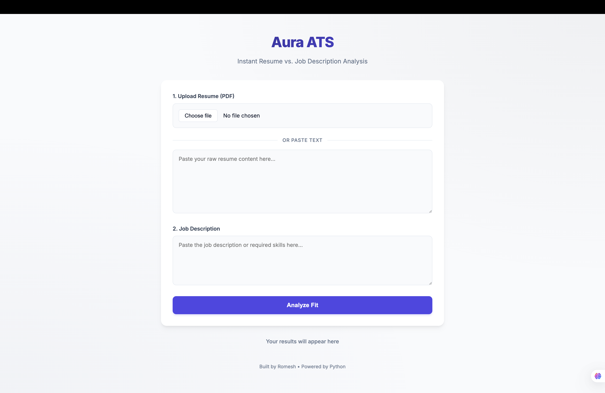
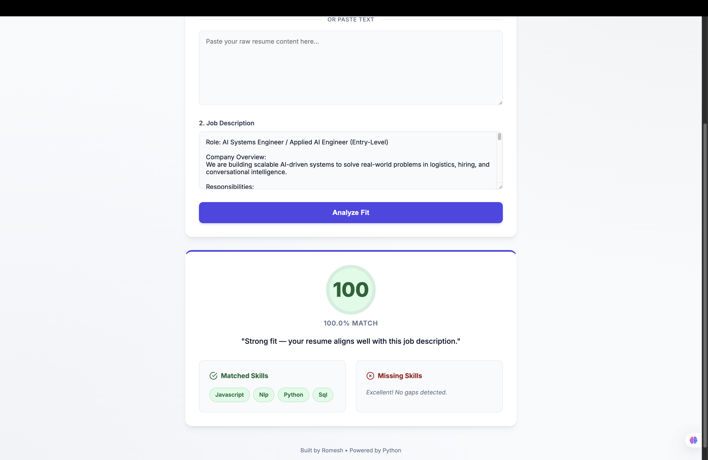
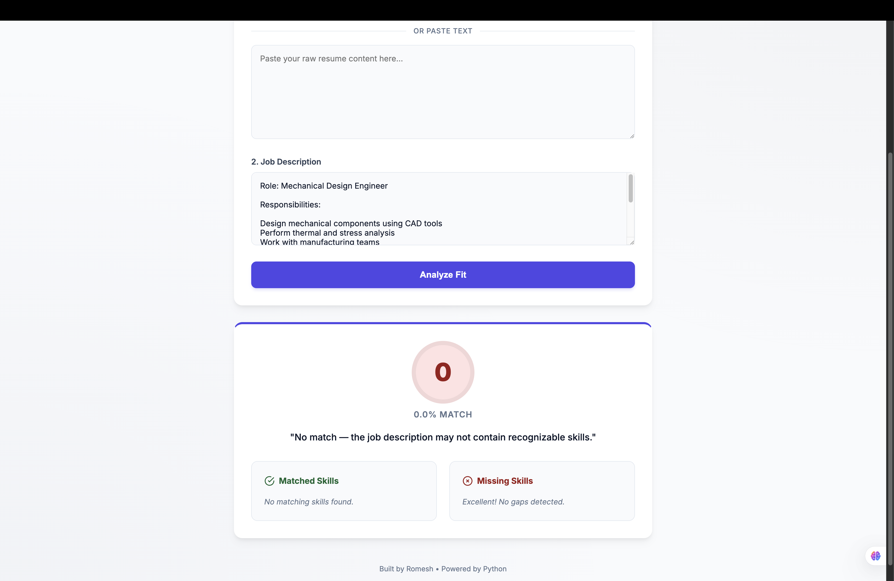
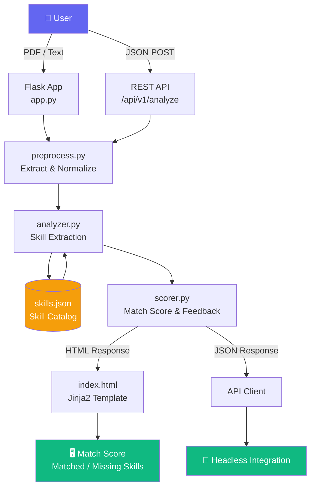
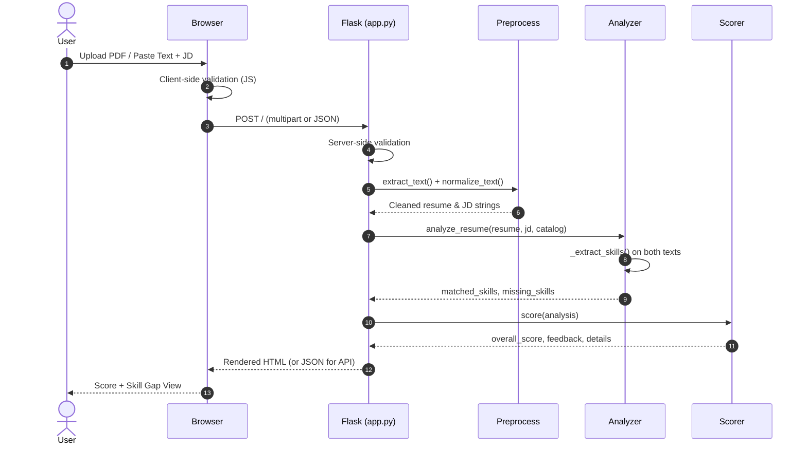

<div align="center">

# 🎯 Aura ATS — AI Resume Analyzer

**Instantly score your resume against any job description using NLP-powered skill matching.**

[](https://www.python.org/)
[](https://flask.palletsprojects.com/)
[](tests/)
[](LICENSE)
[](https://resume-analyzer-mey2.onrender.com/)

[**🚀 Try the Live Demo →**](https://resume-analyzer-mey2.onrender.com/)

</div>

---

## 📌 Overview

**Aura ATS** is a lightweight, production-ready resume analysis tool built with Python and Flask. Upload your resume (PDF or plain text), paste a job description, and instantly receive a match score with a detailed breakdown of matched and missing skills — no heavy ML libraries required.

---

## ✨ Features

| Feature | Details |
|---|---|
| 📄 **PDF Upload** | Parses text-based PDFs via PyPDF2 |
| 📝 **Text Input** | Paste resume text directly in the browser |
| 🎯 **JD Matching** | Extracts and compares skills from both inputs |
| 📊 **Match Score** | 0–100 score with Strong / Moderate / Poor feedback |
| 🟢🔴 **Skill Gap View** | Visual pills showing matched (green) and missing (red) skills |
| 🔌 **REST API** | JSON endpoint at `/api/v1/analyze` for headless integrations |
| ✅ **Dual Validation** | Client-side JS + server-side Flask guards on all inputs |
| 🚢 **Deploy-Ready** | Gunicorn-compatible out of the box |

---

## 🖥️ Demo

> **Live App:** [https://resume-analyzer-mey2.onrender.com/](https://resume-analyzer-mey2.onrender.com/)

**How to use:**
1. **Paste or upload** your resume (PDF or raw text)
2. **Paste** the target job description
3. **Click** "Analyze Fit"
4. **Review** your match score, matched skills, and skill gaps

---

## 📸 Screenshots

### Input Form — Upload or Paste Your Resume
> Enter your resume and job description side-by-side in a clean, minimal interface.



---

### Result View — 100% Match
> When your resume perfectly aligns with the job description — all skills matched, zero gaps.



---

### Result View — No Match (Skill Gap Detected)
> When the job description calls for skills outside the catalog — transparent feedback with zero false positives.



---

## 🏗️ Architecture

### Pipeline Overview

A clean four-stage pipeline with strict separation of concerns:

```
Input  ──→  Preprocess  ──→  Analyze  ──→  Score & Render
```

| Stage | File | Responsibility |
|---|---|---|
| **Extract** | `preprocess.py` | PDF parsing, text normalization |
| **Analyze** | `analyzer.py` | Skill extraction against `skills.json` catalog |
| **Score** | `scorer.py` | Match % calculation, tiered feedback generation |
| **Serve** | `app.py` | Flask routing, validation, HTML + JSON responses |

---

### System Architecture Diagram



---

### Request Flow Diagram



---

### Scoring Logic

```
match_percentage = (matched_skills / total_jd_skills) × 100

Score ≥ 80  →  "Strong fit"
Score ≥ 50  →  "Moderate fit — consider adding: X, Y, Z"
Score  > 0  →  "Poor fit"
Score  = 0  →  "No match / unrecognized skills"
```

---

## 📁 Project Structure

```
resume-analyzer/
├── src/
│   ├── app.py            # Flask routes (web UI + REST API)
│   ├── preprocess.py     # PDF extraction & text normalization
│   ├── analyzer.py       # Skill extraction & JD comparison
│   └── scorer.py         # Scoring engine & feedback logic
├── templates/
│   └── index.html        # UI: form, client-side validation, results display
├── data/
│   └── skills.json       # Extensible skills catalog
├── docs/
│   ├── screenshot-input.png
│   ├── screenshot-result-100.png
│   └── screenshot-result-0.png
├── tests/
│   └── test_scorer.py    # 12 unit tests (edge cases & full coverage)
├── uploads/              # Temporary PDF storage
├── requirements.txt
└── README.md
```

---

## 🛠️ Tech Stack

| Layer | Technology |
|---|---|
| Backend | Python 3.9+, Flask 3.x |
| PDF Parsing | PyPDF2 |
| NLP | Regex + keyword matcher (zero heavy dependencies) |
| Frontend | HTML5, CSS3, Vanilla JS |
| Templating | Jinja2 |
| Production Server | Gunicorn |
| Hosting | Render |

---

## ⚙️ Local Setup

```bash
# 1. Clone the repository
git clone https://github.com/romesh45/resume-analyzer.git
cd resume-analyzer

# 2. Install dependencies
pip install -r requirements.txt

# 3. Run the development server
python -m flask --app src.app run --port 5000
```

Open [http://localhost:5000](http://localhost:5000) in your browser.

### Run Tests

```bash
python -m unittest tests.test_scorer -v
```

---

## 🔌 REST API

Alongside the web UI, the app exposes a JSON endpoint for programmatic access:

**`POST /api/v1/analyze`**

```bash
curl -X POST https://resume-analyzer-mey2.onrender.com/api/v1/analyze \
  -H "Content-Type: application/json" \
  -d '{"resume_text": "Python SQL developer", "job_description": "Python SQL JavaScript"}'
```

**Response:**

```json
{
  "status": "success",
  "data": {
    "overall_score": 67,
    "match_percentage": 66.67,
    "feedback": "Moderate fit — some relevant skills are present, but gaps remain.",
    "details": {
      "matched_skills": ["python", "sql"],
      "missing_skills": ["javascript"]
    }
  }
}
```

---

## ☁️ Deploy to Render

| Setting | Value |
|---|---|
| Environment | Python 3 |
| Build Command | `pip install -r requirements.txt` |
| Start Command | `gunicorn src.app:app` |

> **Note:** Render free-tier instances spin down after inactivity — the first request may take ~30 seconds to wake up.

---

## 🔬 Engineering Highlights

- **Modular pipeline** — Each stage is independently testable and swappable
- **Defensive file handling** — `file.seek(0)` resets and `None` guards prevent PDF stream corruption
- **Dual-layer validation** — JS client-side + Flask server-side; the app never crashes on bad input
- **Zero heavy dependencies** — Pure Python NLP, no spaCy or transformer libraries needed
- **Production-safe paths** — `_BASE_DIR` pattern ensures Gunicorn/WSGI path compatibility
- **12 unit tests** — Edge-case coverage: empty inputs, partial matches, full matches, zero overlap

---

## 🗺️ Roadmap

- [ ] Semantic matching via `sentence-transformers` (synonym & context support)
- [ ] Multi-format uploads (DOCX, TXT)
- [ ] Batch candidate processing
- [ ] Historical score tracking with SQLite
- [ ] Resume improvement suggestions

---

## 👤 Author

**Romesh** — [@romesh45](https://github.com/romesh45)

---

## 📄 License

This project is licensed under the [MIT License](LICENSE).

---

<div align="center">

⭐ If you found this useful, consider starring the repo!

</div>
